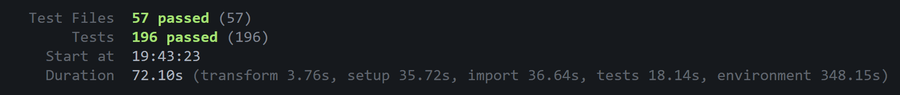

# 🚗 CONCEPT M-MOTORS
**M-Motors** *(entreprise fictive)*, leader dans le secteur des véhicules d'occasion depuis 1987, opère une transformation digitale majeure. Avec un réseau de 800 collaborateurs et un parc servant plus d'un million de clients, l'entreprise modernise son infrastructure pour répondre aux nouveaux usages.

<div align="center">
  
  <br>
  <a href="https://m-motors-skiesland.netlify.app/" target="_blank">🌐 Voir le site en direct</a>
</div>

### **OBJECTIF**
Le projet consistait à développer une plateforme web de type MVP *(Minimum Viable Product)* pour une concession automobile, avec l'introduction d'un service de LLD *(location longue durée)* et d'un espace client pour la dématérialisation des documents clients.
* **Fonctionnalités clés :**
    * **Catalogue** : consultation des véhicules disponibles avec affichage des prix d'achat comptant et de location.
    * **Page description d'un véhicule** : affichage des détails d'un véhicule sélectionné dans le catalogue, incluant description, caractéristiques techniques et grille tarifaire.
    * **Espace client** : permettant de déposer les documents nécessaires à la souscription d'un véhicule et de suivre l'état d'avancement du dossier.

# 📜 Table des matières
- **[🧰 STACKS UTILISÉS](#stacks-utilises)**
- **[⚙️ INSTALLATION ET LANCEMENT](#installation-et-lancement)**
- **[🔄 DÉROULEMENT DU PROJET](#deroulement-du-projet)**
    - **[🎨 PHASE 1 : CONCEPTION ET PRÉPARATION | MAQUETTAGE](#phase-1--conception-et-preparation--maquettage)**
    - **[💻 PHASE 2 : DÉVELOPPEMENT](#phase-2--developpement)**
        - **[🧩 Design System](#design-system-)**
        - **[🔍 Navigation & Référencement](#navigation--referencement-)**
        - **[🏗️ Structure du projet](#structure-du-projet-)**
        - **[🗄️ Base de données des véhicules](#preparation-et-configuration-de-la-base-de-donnees-des-vehicules)**
        - **[🖥️ Affichage dynamique du catalogue](#affichage-dynamique-de-la-page-catalogue-)**
        - **[🚗 Description d'un véhicule](#affichage-dynamique-de-la-page-description-dun-vehicule-)**
        - **[👤 Espace client](#espace-client)**
        - **[📄 Autres pages](#autres-pages)**
    - **[📝 PHASE 3 : CONCEPTION & FONCTIONNALITÉS](#conception-et-fonctionnalites)**
    - **[🧪 PHASE 4 : TESTING & OPTIMISATION](#phase-3--testing-et-optimisation)**
    - **[🚀 PHASE 5 : DÉPLOIEMENT](#phase-4--deploiement)**
- **[👨‍💻 Skies-Land - Jonathan Araldi](#skies-land---jonathan-araldi)**

---

## 🧰 **STACKS UTILISÉS**
- `front-end` : Application développée avec **[Vite](https://vitejs.dev/) + [React](https://react.dev/) + [TypeScript](https://www.typescriptlang.org/) + [Tailwind CSS](https://tailwindcss.com/)**. 
    > 💡*Consulter le fichier **[README.md](./front-end/README.md)** pour les détails de l'architecture du projet côté front-end.*
- `back-end` : API RESTful développée avec **[FastAPI](https://fastapi.tiangolo.com/) + [Python](https://www.python.org/)**, utilisant **[MongoDB Atlas](https://www.mongodb.com/atlas)** comme base de données NoSQL. L'authentification est gérée de manière sécurisée via **JWT (JSON Web Tokens)**. **[Cloudinary](https://cloudinary.com/)** est utilisé pour le stockage des images.
    > 💡*Consulter le fichier **[README.md](./back-end/README.md)** pour les détails de l'architecture du projet côté back-end, ainsi que **[PROJECT_CONFIG.md](./documentation/PROJECT_CONFIG.md)** pour les détails techniques de configuration.*

## ⚙️ **INSTALLATION ET LANCEMENT**
```bash
# Accéder au dossier front-end
cd front-end

# Installer les dépendances
npm install

# Lancer le développement
npm run dev
```

---

## 🔄 **DÉROULEMENT DU PROJET**

### 🎨 **PHASE 1 : CONCEPTION ET PRÉPARATION | MAQUETTAGE**
- **Étape 1 :** J'ai utilisé **[Google Stitch](https://stitch.withgoogle.com/)** pour générer les maquettes du site.
- **Étape 2 :** J'ai affiné les maquettes en éditant certains éléments avec le logiciel de conception **[Pinegrow](https://www.pinegrow.com/)**.
- **Étape 3 :** À partir des fichiers du dossier **[Maquette](./maquette/prototype)**, j'ai procédé au découpage en identifiant les éléments et sections, avec l'ajout de commentaires, dans le but d'identifier et prévoir les composants React nécessaires pour l'architecture du dossier **[front-end](./front-end)**.
> 💡*L'utilisation de **[Google Stitch](https://stitch.withgoogle.com/)** m'a permis d'avoir une base de départ que j'ai pu peaufiner avec le logiciel **[Pinegrow](https://www.pinegrow.com/)** pour démarrer mon développement.*


### 💻 **PHASE 2 : DÉVELOPPEMENT**

#### **🧩 DESIGN SYSTEM :**
* **[Typography](./front-end/src/components/design-system/Typography.tsx)** : gérant le style du texte : *type de balise, taille, couleur, etc.*
* **[Button](./front-end/src/components/design-system/Button.tsx)** : gérant l'apparence et les actions des boutons du site.
* **[Logo](./front-end/src/components/design-system/Logo.tsx)** : gérant l'apparence du logo du site.
* **[Container](./front-end/src/components/design-system/Container.tsx)** : gérant la cohérence dans chaque page. Ce composant utilise des marges automatiques *(mx-auto)*, une largeur maximale stricte *(max-w-7xl)*, et des paddings qui s'adaptent progressivement selon les écrans *(px-4 sm:px-6 lg:px-8 xl:px-12)*. Cela évite que les textes ou le contenu ne touchent les bords sur téléphones ou tablettes, tout en limitant la largeur sur très grand écran pour préserver la lisibilité. Il utilise la propriété `as` pour s'adapter sémantiquement si besoin (bien que défini par défaut sur un simple `div`).
* **[Input](./front-end/src/components/design-system/Input.tsx)** : gérant l'apparence et les fonctionnalités des différents champs de formulaire *(texte, email, mot de passe, etc)*.
* **[Spinner](./front-end/src/components/design-system/Spinner.tsx)** : gérant l'affichage d'un état de chargement pour indiquer que le site est en cours de chargement.
* Intégration de ces composants dans les différentes pages du site. Fonctionnement par `props`, `children` et `switch case` notamment pour les composants `Button` et `Typography`.
> 💡*Le développement d'un **[Design System](./front-end/src/components/design-system)** m'a servi à adopter un design cohérent qui se réplique sur toutes les pages du site et facilement modifiable depuis ces composants.*

#### **🔍 NAVIGATION & RÉFÉRENCEMENT :**
* **[Header](./front-end/src/components/navigation/Header.tsx)** : gérant l'en-tête du site. Regroupant logo, menu de navigation, bouton de connexion.
* **[Footer](./front-end/src/components/navigation/Footer.tsx)** : gérant le pied de page du site. Regroupant logo, liens de navigation, réseaux sociaux, mentions légales.
* **[RootLayout](./front-end/src/components/layout/RootLayout.tsx)** : servant à structurer la page en intégrant les éléments communs (`Header`, `main`, `Footer`).
* **[User-account](./front-end/src/components/navigation/User-account.tsx)** : servant à afficher, à la place du bouton de connexion, le nom utilisateur dans le `Header` avec un bouton de déconnexion pour fermer sa session.
* **[SEO](./front-end/src/components/seo/Seo.tsx)** : servant à identifier la page par son titre et sa description.
* **[router.tsx](./front-end/src/routes/router.tsx)** : gérant les routes pour la navigation entre les pages, avec la dépendance **[React Router](https://reactrouter.com/)**
> 💡*Cette structure de navigation me sert à avoir une cohérence des éléments React à charger entre chaque page. Plus d'information sur cette structure dans le fichier **[README.md](./front-end/README.md)**.*

#### **🏗️ STRUCTURE DU PROJET :** 
Chaque partie du site est découpée par dossier, chaque dossier représente une **[page](./front-end/src/pages)**. Suivie de sous-dossiers :
* `src/pages/nom-de-la-page/` : dossier représentant la page et les sous-dossiers associés.
* `src/pages/nom-de-la-page/components/` : dossier regroupant les différentes éléments graphiques qui composent la page.
* `src/pages/nom-de-la-page/features/` : dossier regroupant des petites fonctionnalités clés de la page.
* `src/pages/nom-de-la-page/functions/` : dossier regroupant les fonctions de logique de la page.
* **[router.tsx](./front-end/src/routes/router.tsx)** : ce composant gère les redirections et les différents chemins de navigation entre les pages du site.
    * Le routeur utilise le **[Lazy Loading](https://react.dev/reference/react/lazy)** (ou chargement paresseux) via `React.lazy()` et le composant **[Suspense](https://react.dev/reference/react/Suspense)**. Cela permet de découper l'application en modules (chunks) et de ne charger que le code JavaScript strictement nécessaire à la page affichée. Cette technique réduit le temps de chargement initial et accélère l'affichage LCP *(Largest Contentful Paint)*. Le composant `Spinner` gère l'interface de transition pendant le chargement des pages.
>💡*Cette structure de dossier principale par page et de sous-dossier, me sert à séparer la logique fonctionnelle du contenu graphique de la page. Le but étant que le code soit plus facilement maintenable et plus facile à comprendre. Plus d'informations sur cette structure dans le fichier **[README.md](./front-end/README.md)**.*

#### **🗄️ PRÉPARATION ET CONFIGURATION DE LA BASE DE DONNÉES DES VÉHICULES :**
* Pour la gestion des données du catalogue de véhicules, j'ai choisi d'opter pour **[MongoDB Atlas](https://www.mongodb.com/atlas)** comme base de données NoSQL cloud, couplée à une API **[FastAPI](https://fastapi.tiangolo.com/)**. 
* L'accès et la validation des données côté back-end sont gérés via l'ODM *(Object-Document Mapper)* **[Beanie](https://beanie-odm.dev/)**.
* J'ai configuré une collection nommée `vehicles` avec la structure suivante :

| Champ | Type | Description |
| :--- | :--- | :--- |
| `id` | `string` | Identifiant unique du véhicule |
| `brand` | `string` | Marque du véhicule |
| `model` | `string` | Modèle du véhicule |
| `category` | `string` | Catégorie (ex: Berline, SUV, Sport) |
| `year` | `number` | Année de mise en circulation |
| `mileage` | `number` | Kilométrage |
| `slogan` | `string` | Accroche commerciale |
| `imageUrl` | `string` | URL Cloudinary de l'image principale |
| `description` | `string` | Description détaillée |
| `technicalSpecs` | `dict` | Objet contenant les performances (voir ci-dessous) |
| `acquisition` | `dict` | Détails financiers et disponibilité (voir ci-dessous) |

**Détails des objets :**
* **`technicalSpecs`** :
    * `acceleration` (number) : Accélération du véhicule (0 à 100 km/h en secondes)
    * `topSpeed` (number) : Vitesse max en km/h
    * `power` (number) : Puissance en chevaux
    * `engine` (string) : Type de motorisation
* **`acquisition`** :
    * `purchasePrice` (number \| null) : Prix de vente
    * `rentalPrice` (number \| null) : Loyer mensuel
    * `isAvailableForSale` (boolean) : Disponibilité à la vente
    * `isAvailableForRent` (boolean) : Disponibilité à la location

**Interface TypeScript correspondante côté Front-End :**
```typescript
interface Vehicle {
  id: string;
  brand: string;
  model: string;
  category: string;
  year: number;
  mileage: number;
  slogan: string;
  imageUrl: string;
  description: string;
  technicalSpecs: {
    acceleration: number;
    topSpeed: number;
    power: number;
    engine: string;
  };
  acquisition: {
    purchasePrice: number | null;
    rentalPrice: number | null;
    isAvailableForSale: boolean;
    isAvailableForRent: boolean;
  };
}
```

* Les endpoints de l'API (ex: composant **[vehicles.py](./back-end/app/api/endpoints/vehicles.py)**) permettent de lire les données publiques, tandis que les modifications nécessitent une authentification via un jeton JWT *(JSON Web Token)*.
* Concernant les images de chaque véhicule, elles sont stockées avec le service de stockage cloud **[Cloudinary](https://cloudinary.com/)**.
* Les communications entre le front-end et l'API back-end sont centralisées avec le fichier de configuration **[api-config.ts](./front-end/src/config/api-config.ts)**. Les identifiants de la base de données et les clés secrètes du back-end sont sécurisés via une variable d'environnement `.env` *(ignorée par Git pour la sécurité)*.
> 💡 *Initialement construit avec **[Firebase](https://firebase.google.com/en)** comme première version d'essaie, le projet a été migré vers une architecture **[FastAPI](https://fastapi.tiangolo.com/)** et **[MongoDB](https://www.mongodb.com/)** pour offrir plus de contrôle, de flexibilité et de meilleures performances.*

#### **🖥️ AFFICHAGE DYNAMIQUE DE LA PAGE CATALOGUE :**
* Le composant **[Catalog-page-view](./front-end/src/pages/3-catalog-page/Catalog-page-view.tsx)** sert à afficher la page de catalogue du site. Il est composée de plusieurs éléments :
    * **[Vehicle-card-catalog-page](./front-end/src/pages/3-catalog-page/components/2-1-Vehicle-card-catalog-page.tsx)** : servant à identifer et présenter les données de véhicule sous forme d'une carte. Les informations sont identifiées via des `props` et intégrer au composant suivant.
    * **[Vehicles-grid-cards-catalog-page](./front-end/src/pages/3-catalog-page/components/2-2-Vehicles-grid-cards-catalog-page.tsx)** : servant à gérer la disposition des véhicules du catalogue, sous forme d'une grille. Ce composant utilise la fonction **[GetVehicles](./front-end/src/api/Get-vehicles.tsx)** qui sert à récupérer les données de la collection `vehicles` de la base de données **MongoDB**. `useEffect` est utilisé pour récupérer les données une seule fois au montage du composant.

* **Fonctionnalités clés liées à cette page :**
    * **[Pagination-catalog](./front-end/src/pages/3-catalog-page/components/features/Pagination-catalog-page.tsx)** : gérant l'affichage de la pagination de la page de catalogue. La fonction de logique est séparée dans le composant **[Paginate-vehicles-catalog](./front-end/src/pages/3-catalog-page/components/functions/Paginate-vehicles-catalog-page.tsx)**.
    * **[Search-filter-catalog](./front-end/src/pages/3-catalog-page/components/features/Search-filter-catalog-page.tsx)** : gérant l'affichage de la recherche et du filtrage des véhicules du catalogue. Ce composant est associé à deux fonctions de logique :
        * **[Get-brands-catalog](./front-end/src/api/Get-brands-catalog.tsx)** : servant à récupérer les données par marque de véhicule depuis la collection **MongoDB** `vehicles`.
        * **[Filter-vehicles-catalog-page](./front-end/src/pages/3-catalog-page/components/functions/Filter-vehicles-catalog-page.tsx)** : servant à filtrer les véhicules du catalogue en fonction de la marque et du budget.

#### **🚗 AFFICHAGE DYNAMIQUE DE LA PAGE DESCRIPTION D'UN VÉHICULE :**
* Le composant **[Vehicle-page-view](./front-end/src/pages/4-vehicle-page/Vehicle-page-view.tsx)** sert à afficher la page de description d'un véhicule en fonction de son ID et des `props` sélectionnées dans chaque sous-composants.
    * **[Hero-vehicle-page](./front-end/src/pages/4-vehicle-page/components/1-Hero-vehicle-page.tsx)** : sert à afficher la bannière de la page de description d'un véhicule. L'image est récupérée par la propriété -> `vehicle.imageUrl` de la base de données.
    * **[Description-vehicle-page](./front-end/src/pages/4-vehicle-page/components/2-Description-vehicle-page.tsx)** : sert à afficher un texte explicatif sur le véhicule et ses informations techniques.
    * **[Acquisition-method-vehicle-page](./front-end/src/pages/4-vehicle-page/components/3-Acquisition-method-vehicle-page.tsx)** : sert à afficher deux options d'acquisition (achat ou location) avec les prix correspondants à l' `ID` du véhicule.
    * **[Tarif-catalog-vehicle-page](./front-end/src/pages/4-vehicle-page/components/4-Tarif-catalog-vehicle-page.tsx)** : sert à afficher une grille tarifaire pour la méthode d'acquisition par location en fonction du prix d'achat du véhicule correspondant à son `ID`. Une formule est utilisée pour calculer le tarif de location en fonction du nombre de mois (24, 36, 48, 72) choisie pour la location.
    * **[Get-description-vehicle](./front-end/src/api/Get-description-vehicle-page.tsx)** : est la fonction de logique permettant de récupérer les détails d'un véhicule spécifique depuis la base de données. Cette fonction est implémentée dans le composant **[Vehicle-page-view](./front-end/src/pages/4-vehicle-page/Vehicle-page-view.tsx)**.
    > 💡*Les informations textuelles et les images de chaque véhicule ont été générées par IA afin de disposer de contenu à développer pour être affiché sur le site.*

#### **👤 ESPACE CLIENT**
* **Formulaire de connexion / inscription / mot de passe oublié :**
   * Le composant **[Login-page-view](./front-end/src/pages/6-login-page/Login-page-view.tsx)** sert de conteneur principal. Il gère l'affichage conditionnel des trois sous-formulaires :
       * **[Login-form](./front-end/src/pages/6-login-page/components/1-Login-form.tsx)** : formulaire principal de connexion. Au clic sur *mot de passe oublié ?*, il bascule l'affichage vers le formulaire de réinitialisation.
       * **[Register-form](./front-end/src/pages/6-login-page/components/2-Register-form.tsx)** : formulaire de création de compte.
       * **[Forget-password-form](./front-end/src/pages/6-login-page/components/3-Forget-password-form.tsx)** : formulaire dédié à la récupération de compte.
   * La logique fonctionnelle est séparée de la couche graphique via des fonctions personnalisés interrogeant l'API FastAPI. Côté back-end, ces requêtes sont traitées par les endpoints configurés dans **[auth.py](./back-end/app/api/endpoints/auth.py)** :
       * **[Login-function](./front-end/src/pages/6-login-page/components/functions/Login-function.tsx)** : gérant l'authentification en envoyant les identifiants à l'API et en stockant le token JWT *(JSON Web Token)* retourné.
       * **[Register-function](./front-end/src/pages/6-login-page/components/functions/Register-function.tsx)** : gérant la création de compte via l'API, avec hachage sécurisé du mot de passe côté serveur (`bcrypt`). Le composant **[security.py](./back-end/app/core/security.py)** permet de sécuriser et de hacher le mot de passe de l'utilisateur avant de l'enregistrer dans la base de données.
       * **[Forget-password-function](./front-end/src/pages/6-login-page/components/functions/Forget-password-function.tsx)** : composant préparé pour la réinitialisation par email, mais non fonctionnel pour le moment, car nécéssitant une configuration de serveur.

* **Gestion de la session utilisateur :**
    * **[AuthUserProvider](./front-end/src/context/AuthUserContext.tsx)** : chef d'orchestre de la session utilisateur. Il gère l'état de connexion en stockant et validant le token JWT via la **[Context API de React](https://www.bureaudestalents.com/glossaire-tech/context-api)**.
    * **[Get-user](./front-end/src/api/Get-user.tsx)** : logique permettant de récupérer le profil complet de l'utilisateur dans **MongoDB** (collection `users`) en utilisant l'identifiant (`id`) du token.
    * **Hook `useAuth()`** : interface simplifiée permettant aux composants (comme le `Header`) de réagir dynamiquement au statut de connexion.

* **Sécurisation et Typage :**
    * **[Session-status.tsx](./front-end/src/constants/Session-status.tsx)** : définit les constantes de valeurs (`GUEST`, `REGISTERED`) utilisées pour la logique de navigation et d'affichage.
    * **[Session-status-type.tsx](./front-end/src/types/Session-status-type.tsx)** : définit le contrat de type TypeScript pour garantir qu'aucune valeur de statut invalide ne soit utilisée dans le code.
    > 💡 *La session est persistante : au montage de l'application, **[AuthUserProvider](./front-end/src/context/AuthUserContext.tsx)** récupère le `token` JWT *(JSON Web Token)* et les informations de l'utilisateur depuis le `localStorage` du navigateur. L'utilisateur reste ainsi connecté même après avoir actualisé la page ou fermé son navigateur.*

* **Dashboard client :**
   * **[Account-page-view](./front-end/src/pages/7-account-page/Account-page-view.tsx)** : sert à afficher l'espace client de l'utilisateur lui permettant une visibilité immédiate sur l'ensemble des actions qu'il peut faire. Le composant gère l'affichage conditionnel des sous-composants :
        * **[Sidebar-account](./front-end/src/pages/7-account-page/components/features/Sidebar-account.tsx)** : servant à afficher la barre latérale gauche de l'espace client avec les liens vers les différentes sections de l'espace client. Implémentation de la fonction **[Active-link-sidebar-account](./front-end/src/pages/7-account-page/components/functions/Active-link-sidebar-account.tsx)** pour rendre dynamique l'apparence des liens actifs.
        * **[Edit-profil](./front-end/src/pages/7-account-page/components/1-Edit-profil-account.tsx)** : servant à afficher un formulaire pour l'édition du profil de l'utilisateur en renseignant ou modifiant son *(nom d'utilisateur, prénom, nom, adresse e-mail, adresse postale et numéro de téléphone)*. Le composant utilise le hook **[Edit-profil-account-function](./front-end/src/pages/7-account-page/components/functions/Edit-profil-account-function.tsx)** qui appelle l'API FastAPI **[Update-user](./front-end/src/api/Update-user.tsx)** (`PATCH`) pour transmettre les modifications. Côté back-end, c'est l'endpoint configuré dans **[users.py](./back-end/app/api/endpoints/users.py)** qui traite la requête et met à jour le profil dans la collection **MongoDB** `users`.
        * **[Docs-account](./front-end/src/pages/7-account-page/components/2-Docs-acount.tsx)** : servant à uploader les documents justificatifs du client *(Pièce d'identité, Justificatif de domicile, Bulletins de salaire, Permis de conduire)*. L'interface gère l'aperçu dynamique via **[Preview-document-account](./front-end/src/pages/7-account-page/components/features/Preview-document-account.tsx)** et le statut de validation via **[Validation-document-function](./front-end/src/pages/7-account-page/components/functions/Validation-document-function.tsx)**. Ce composant pemettant d'ajouter une indication visuelle dans l'interface client, informant sur l'état de traitement du ou des documents envoyés. Le processus est orchestré par le hook **[Send-document-function](./front-end/src/pages/7-account-page/components/functions/Send-document-function.tsx)** qui utilise la logique de contrôle **[Check-document-upload-function](./front-end/src/pages/7-account-page/components/functions/Check-document-upload-function.tsx)**.
            > 💡 *Pour le moment l'upload de document est simuler en local storage pour les besoins de la présentation du projet.*
        * **[Services-account](./front-end/src/pages/7-account-page/components/3-Services-account.tsx)** : servant à afficher les services que le client peux réserver. Le composant affiche un message placeholder invitant l'utilisateur à patienter pour la mise en place future de cette fonctionnalité.
        * **[Booking-account](./front-end/src/pages/7-account-page/components/4-Booking-account.tsx)** : servant à afficher l'historique des réservations du client. Le composant affiche un message placeholder invitant l'utilisateur à patienter pour la mise en place future de cette fonctionnalité.

* **Sécurisation des routes :**
    * La navigation est contrôlée dans le fichier **[router.tsx](./front-end/src/routes/router.tsx)** à l'aide de composants "Wrappers" qui filtrent l'accès selon le statut de l'utilisateur fourni par **[AuthUserContext](./front-end/src/context/AuthUserContext.tsx)**.

    | Composant | Cible | Condition | Action si non respectée |
    | :--- | :--- | :--- | :--- |
    | **ProtectedRoute** | `/account` | Utilisateur connecté | Redirection vers `/login` |
    | **GuestRoute** | `/login` | Utilisateur invité | Redirection vers `/account` |

    *   **[ProtectedRoute](./front-end/src/components/navigation/ProtectedRoute.tsx)** : garantit que **seules les personnes authentifiées** accèdent aux sections sensibles.
    *   **[GuestRoute](./front-end/src/components/navigation/GuestRoute.tsx)** : évite **qu'un utilisateur déjà connecté** ne retourne sur les formulaires d'authentification.
    > 💡 *Ces composants gèrent un état de chargement `loading`. Tant que l'API n'a pas confirmé la validité de la session (via le token JWT), un spinner est affiché, empêchant ainsi tout affichage non désiré de contenu protégé ou de redirection prématurée.*

#### **📄 AUTRES PAGES**
* **[About-page-view](./front-end/src/pages/2-about-page/About-page-view.tsx)** : servant à afficher une brève description de l'entreprise, les services qu'elle propose et une section FAQ.
    * **[Get-faq](./front-end/src/api/Get-faq.tsx)** : est la fonction de logique permettant de récupérer les questions et réponses de la section FAQ depuis l'API FastAPI. Les requêtes sont gérées côté back-end par le composant **[faqs.py](./back-end/app/api/endpoints/faqs.py)**. Cette fonction est implémentée dans le composant **[FAQ-about-page](./front-end/src/pages/2-about-page/components/4-FAQ-about-page.tsx)**.<br>
J'ai configuré cette collection de données nommée `faqs` sur **MongoDB** avec la structure suivante :

| Champ | Type | Description |
| :--- | :--- | :--- |
| `id` | `string` | Identifiant unique de la question |
| `question` | `string` | La question posée |
| `answer` | `string` | La réponse à la question |

**Interface TypeScript correspondante :**

```typescript
interface FAQItem {
  id: string;
  question: string;
  answer: string;
}
```
> 💡 *L'externalisation des données de la section FAQ vers **MongoDB** facilite grandement la gestion des questions/réponses (ajout, modification, suppression) par l'équipe back-office de M-Motors via de simples requêtes d'API.*

* **[Contact-page-view](./front-end/src/pages/5-contact-page/Contact-page-view.tsx)** : servant à afficher un formulaire de contact pour permettre aux utilisateurs de contacter l'entreprise en choisisant parmis un menu déroulant le sujet de leur demande. <br> **⚠️ Ce formulaire n'est pas relié à une base de données et n'est donc pas fonctionnel. Il est présent à titre de présentation.⚠️**
* **[Error-page-view](./front-end/src/pages/8-error-page/Error-page-view.tsx)** : servant à afficher une page pour informer l'utilisateur que le contenu demandé n'existe pas *(ou n'est plus référencé)* et lui propose deux solutions pour retrouver ce qu'il cherche *(Retour à l'accueil et Revenir à la page précédente)*.


#### 📝 **PHASE 3 : CONCEPTION & FONCTIONNALITÉS**
L'ensemble des fonctionnalités de l'application a été cartographié sous forme de User Stories pour garantir une expérience utilisateur cohérente et répondre aux besoins métiers.
* **[Cartographie des User Stories](./documentation/USER_STORIES.md)**


### 🧪 **PHASE 4 : TESTING & OPTIMISATION**
#### **Tests unitaires :**
👉 Tests unitaires effectués sur la branche : **[feature-tests](https://github.com/Skies-Land/Concept-M-Motors/tree/feature-tests)**

> 💡 *J'ai séparé les tests unitaires dans une branche dédiée `feature-tests` pour ne pas impacter la branche principale `main` où **[Netlify](https://www.netlify.com/)** effectue les déploiements automatiques. Ainsi le projet reste stable et fonctionnel pour les utilisateurs.*

L'application bénéficie d'une suite de tests unitaires pour garantir la fiabilité des composants et de la logique fonctionnelle. Toutes les parties du site ont été testées, de l'interface utilisateur aux fonctionnalités principales. Les tests utilisent les bibliothèques suivantes :
* **[Vitest](https://vitest.dev/)** pour l'exécution des tests,
* **[React Testing Library](https://testing-library.com/docs/react-testing-library/intro/)** pour le rendu des composants,
* **[jsdom](https://github.com/jsdom/jsdom)** pour la simulation de l'environnement du navigateur (DOM).

| Composants & Fonctionnalités testés | Libraries / Méthodes utilisées |
| :--- | :--- |
| **[Components](./front-end/src/components)** (Navigation, Design System, UI éléments) | `render()`, `screen.getBy...()`, `fireEvent.click()`, Mocks |
| **[Pages](./front-end/src/pages)** (Landing, About, Catalog, Contact, Login, Account, Error) | `MemoryRouter`, `Routes`, `Route`, Mocks |
| **`Functions`** (Logique métier) | Mocks complexes, `async/await`, `vi.fn()`, `vi.clearAllMocks()` |

J'ai structuré mes tests en suivant le **[Pattern AAA](https://learn.microsoft.com/fr-fr/visualstudio/test/unit-test-basics?view=visualstudio)**, voici ma base de code utilisé pour l'ensemble de mes tests unitaires :

```typescript
// TESTING LIBRARY - utils de rendu et sélection DOM
import { render, screen } from '@testing-library/react';

// VITEST - framework de test
import { describe, it, expect, vi } from 'vitest';

// REACT ROUTER - composants de navigation pour tests
import { MemoryRouter, Routes, Route } from 'react-router-dom';

// Pattern de tests AAA (Arrange, Act, Assert)
// 1. ARRANGE (préparation : initialisation du composant)
// 2. ACT (agir : action effectuer)
// 3. ASSERT (vérification : résultat obtenu correspondant au résultat attendu)

// COMPOSANT À TESTER
import nomDuComposantATester from './';

describe("nomDuComposantATester", () => {
    it("Description de l'objectif du test", () => {
        // 1. ARRANGE (préparation)

        // 2. ACT (agir/action)

        // 3. ASSERT (vérification)
    });
});
```

**Résultats des tests unitaires :**



#### **AUDIT D'OPTIMISATION :**
Après les tests unitaires, j'ai effectué des optimisations des performances du site avec l'outil **[Lighthouse / PageSpeed Insights](https://pagespeed.web.dev/)**. Les performances, l'accessibilité et le référencement ont été optimisés sur la branche : `feature-lighthouse-optimization` avant d'être fusionnée avec la branche `main`. Voici la **[Documentation des optimisations effectuées](./documentation/LIGHTHOUSE_REPORT.md)**.


### 🚀 **PHASE 5 : DÉPLOIEMENT**

Le déploiement de cette application Full-Stack repose sur une architecture découplée, utilisant des services spécialisés pour le Front-End et le Back-End.

* **Déploiement côté front-end (Interface Client) :**
Le projet Front-End (React/Vite) est déployé sur **[Netlify](https://www.netlify.com/)** avec une intégration continue (CI/CD) liée au dépôt GitHub à partir de la branche `main`.
    * **Hébergement** : Netlify (Base directory: `front-end`).
    * **Build** : Automatisation via `npm run build` et `dist`.
    * **Routage** : Support du Single Page Application (SPA) via un fichier `_redirects` dans le dossier `public` pour rediriger toutes les requêtes vers `index.html`.
    > 💡 *`_redirects` est un fichier qui permet de configurer les redirections du site. Il permet d'indiquer à Netlify de rediriger toutes les requêtes vers `index.html` pour que React Router puisse prendre le relais.*

* **Déploiement côté back-end (Serveur API) :**
L'API FastAPI est hébergée sur **[Render](https://render.com/)**, un service cloud optimisé pour les applications web dynamiques.
    * **Hébergement** : Render Web Service (Root directory: `back-end`).
    * **Build & Démarrage** : Installation automatique des dépendances (`requirements.txt`) et exécution via le serveur ASGI Uvicorn (`uvicorn app.main:app`).
    * **Sécurité & Variables** : Configuration des variables d'environnement (URI MongoDB, Clé JWT) directement dans l'interface sécurisée de Render.

* **Explication du fonctionnement technique du site :**
Cette architecture découplée (Headless) permet à chaque partie du projet de vivre et d'évoluer indépendamment :
    1. Lorsqu'un utilisateur visite le site, **Netlify** lui sert instantanément l'interface graphique générée par React.
    2. Dès que l'utilisateur a besoin de données dynamiques (voir le catalogue, se connecter, modifier son profil), le Front-End envoie une requête HTTP (via `fetch`) vers l'URL de l'API hébergée sur **Render**.
    3. L'API **FastAPI** sur Render reçoit la requête, interroge la base de données **MongoDB Atlas**, valide les informations, puis renvoie les données au format JSON.
    4. Le Front-End met à jour l'interface en temps réel avec ces nouvelles données.

L'utilisation de la variable d'environnement dynamique (`VITE_API_BASE_URL`) permet au Front-End sur Netlify de cibler automatiquement le serveur de production Render, assurant une communication fluide entre les deux environnements.


## 👨‍💻 Skies-Land - Jonathan Araldi
- **[Portfolio](https://portfolio-jonathan-araldi.netlify.app/)** | **[LinkedIn](https://www.linkedin.com/in/jonathan-araldi/)** | **[GitHub](https://github.com/Skies-Land)**
