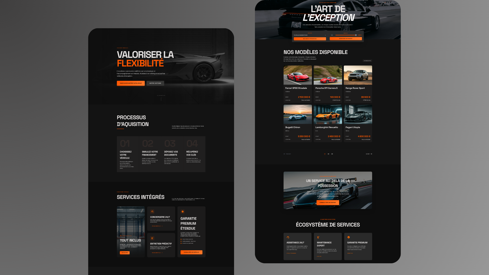

# 🚗 CONCEPT M-MOTORS
**M-Motors** *(entreprise fictive)*, leader dans le secteur des véhicules d'occasion depuis 1987, opère une transformation digitale majeure. Avec un réseau de 800 collaborateurs et un parc servant plus d'un million de clients, l'entreprise modernise son infrastructure pour répondre aux nouveaux usages.

  
   
  <a href="https://m-motors-skiesland.netlify.app/" target="_blank">🌐 Voir le site en direct</a>

### **OBJECTIF**
Le projet consistait à développer une plateforme web de type MVP *(Minimum Viable Product)* pour une concession automobile, avec l'introduction d'un service de LLD *(location longue durée)* et d'un espace client pour la dématérialisation des documents clients.
* **Fonctionnalités clés :**
    * **Catalogue** : consultation des véhicules disponibles avec affichage des prix d'achat comptant et de location.
    * **Page description d'un véhicule** : affichage des détails d'un véhicule sélectionné dans le catalogue, incluant description, caractéristiques techniques et grille tarifaire.
    * **Espace client** : permettant de déposer les documents nécessaires à la souscription d'un véhicule et de suivre l'état d'avancement du dossier.

---
#### Branche Git dédiée à la phase d'optimisation. Pour consulter la documentation complète ➡️ **[la branche `main`](https://github.com/Skies-Land/Concept-M-Motors)**

### 🧪 **PHASE D'OPTIMISATION**

Après les tests unitaires, j'ai effectué des optimisations des performances du site avec l'outil **[Lighthouse / PageSpeed Insights](https://pagespeed.web.dev/)**. Les performances, l'accessibilité et le référencement ont été optimisés sur la branche : `feature-lighthouse-optimization` avant d'être fusionnée avec la branche `main`. Voici la **[Documentation des optimisations effectuées](./documentation/LIGHTHOUSE_REPORT.md)**.

## 👨‍💻 Skies-Land - Jonathan Araldi
- **[Portfolio](https://portfolio-jonathan-araldi.netlify.app/)** | **[LinkedIn](https://www.linkedin.com/in/jonathan-araldi/)** | **[GitHub](https://github.com/Skies-Land)**
