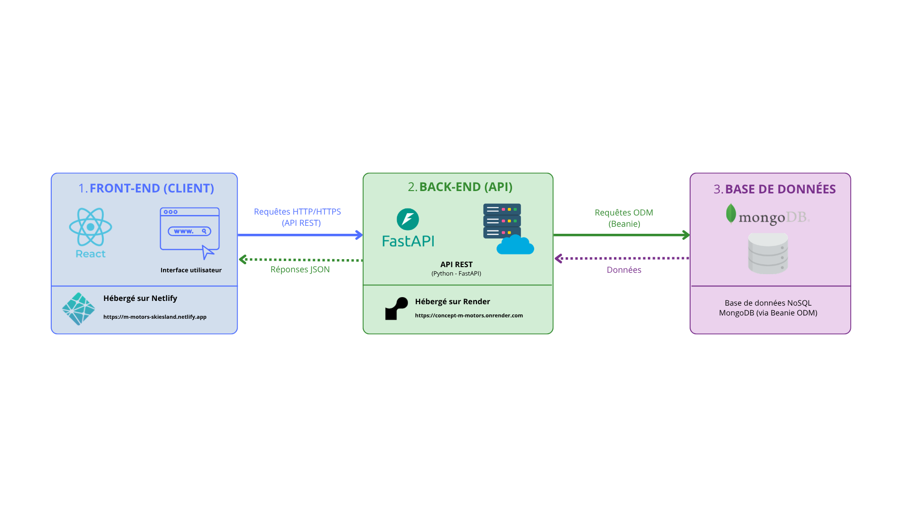
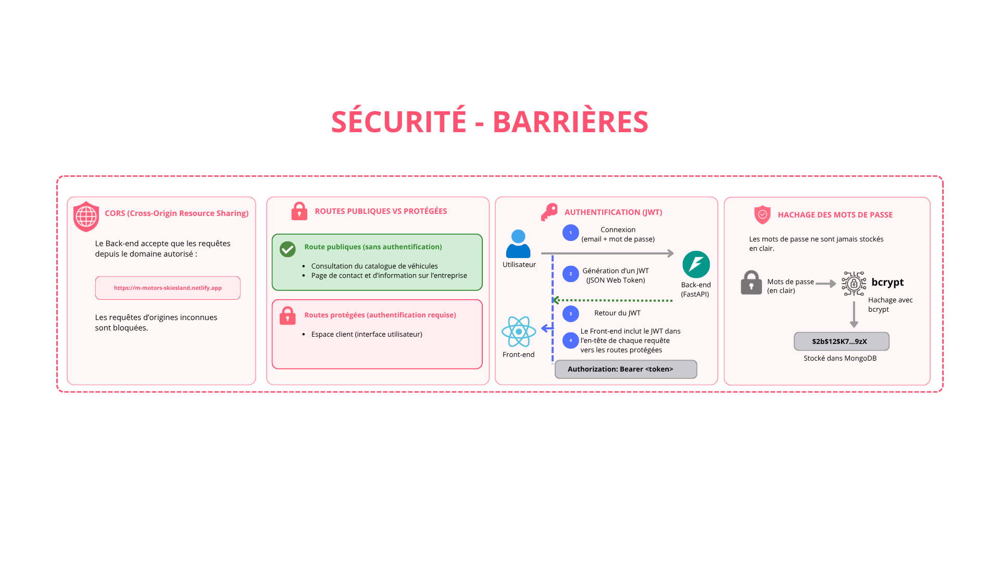
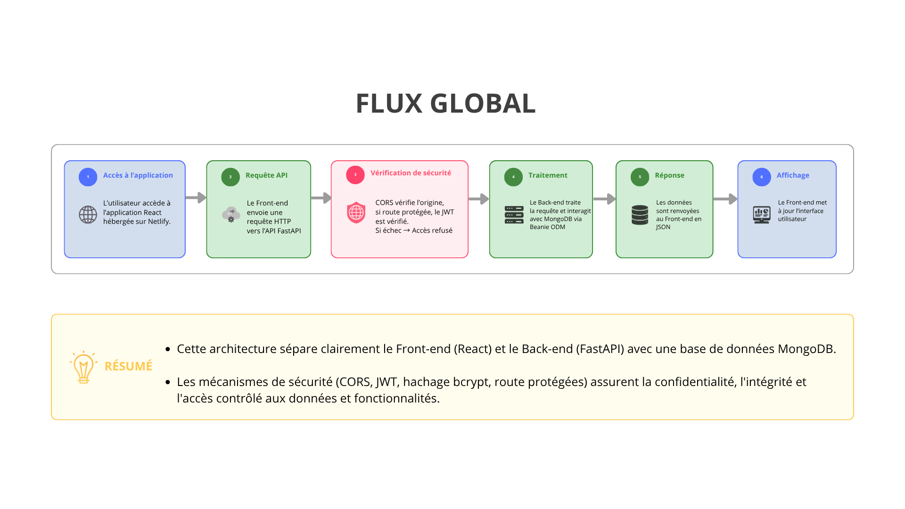
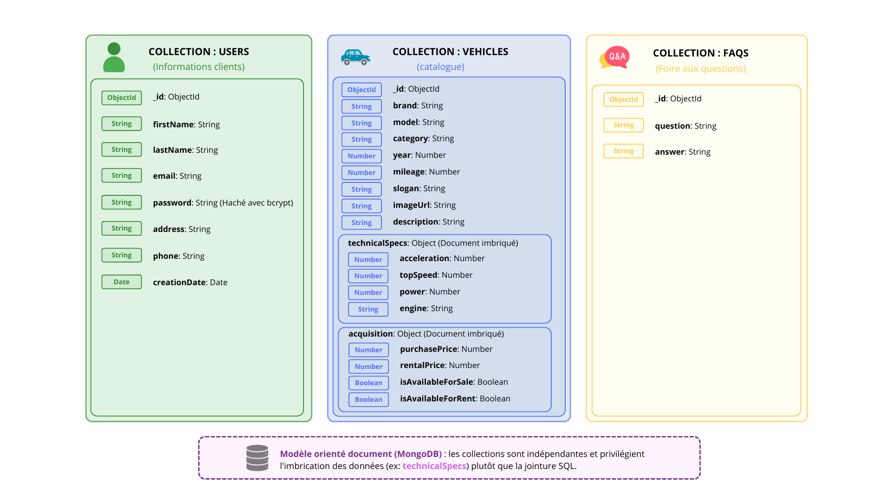

# ARCHITECTURE ET MODÈLE DE DONNÉES

Ce document présente l'architecture logicielle de l'application M-Motors ainsi que son Modèle Orienté Document. Il a pour but de faciliter la compréhension globale du projet, des interactions entre les différents services (Front-end et Back-end), et des mécanismes de sécurité mis en place.

## 🏗️ Architecture de la solution
Ce schéma se concentre spécifiquement sur les technologies, les plateformes d'hébergement et la structure technique de l'application :

*   **Front-end (Client) :** Application développée en **[React](https://react.dev/)** et hébergée sur **[Netlify](https://www.netlify.com/)**. Elle gère l'interface utilisateur et envoie des requêtes HTTP au serveur.
*   **Back-end (API) :** API REST développée en **[Python](https://www.python.org/) avec [FastAPI](https://fastapi.tiangolo.com/)** et hébergée sur **[Render](https://render.com/)**. Elle expose les routes (Endpoints) pour manipuler les données.
*   **Base de données :** Base de données NoSQL **[MongoDB](https://www.mongodb.com/)** (hébergée sur **[MongoDB Atlas](https://www.mongodb.com/atlas)**), manipulée via l'ODM **[Beanie](https://docs.crimsonhex.com/beanie/latest/)**.

## 🛡️ Mécanismes de sécurité
Ce schéma détaille les différentes méthodes de protection implémentées :

*   **CORS (Cross-Origin Resource Sharing) :** Le Back-end est configuré pour n'accepter que les requêtes provenant du domaine spécifique du Front-end (**[Netlify](https://www.netlify.com/)**), bloquant ainsi les requêtes d'origines inconnues.
*   **Authentification (JWT) :** Lors de la connexion, le Back-end génère un **JSON Web Token (JWT)**. Ce token est ensuite inclus par le Front-end dans les en-têtes (`Authorization: Bearer <token>`) de chaque requête vers une route protégée.
*   **Hachage des mots de passe :** Les mots de passe des utilisateurs ne sont jamais stockés en clair. Ils sont hachés avec **bcrypt** avant d'être sauvegardés dans **MongoDB**.
*   **Routes publiques vs Protégées :**
    *   ***Publiques*** : Accès au catalogue de véhicules, prise de contact.
    *   ***Protégées*** : Espace administrateur, ajout/modification de véhicules, gestion des utilisateurs.

## 🔄 Flux de fonctionnement
Ce schéma présente de manière séquentielle comment les requêtes sont traitées et comment l'application réagit aux actions des utilisateurs :

## 🧰 Modèle Orienté Document
Contrairement aux bases de données relationnelles (SQL), **MongoDB** est une base de données NoSQL. Ce modèle représente de manière visuelle les différentes collections de la base de données et la structure des documents qui y sont stockés (notamment l'imbrication des données).

### Entités principales (collections MongoDB)
*   **Users (Utilisateurs) :** Les informations relative aux clients.
*   **Vehicles (Véhicules) :** Les données du catalogue de véhicules.
*   **FAQ :** Les questions fréquentes et leurs réponses.
    > 💡 *L'intégration de la collection `faqs` dans la base de données a pour but de facilité la mise à jour de la section FAQ du site par l'intermédiaire de l'équipe back-office.*

### Remarques sur le modèle
Étant sur une base de données orientée document (**MongoDB**), l'approche diffère d'un MCD (Modèle Conceptuel de Données) classique. Certaines données sont directement imbriquées dans un document (par exemple, les objets `technicalSpecs` et `acquisition` dans le document du véhicule) plutôt que de nécessiter la création de tables de jointure complexes.

## 📤 Déploiement et environnement
*   **Variables d'environnement :** Les informations sensibles *(URI de la base de données, Clé secrète JWT)* sont stockées dans des variables d'environnement (`.env` en local) et configurées de manière sécurisée sur les plateformes de déploiement (**[Render](https://render.com/)**, **[Netlify](https://www.netlify.com/)**). Elles ne sont jamais poussées sur GitHub.

## 👨‍💻 Skies-Land - Jonathan Araldi
- **[Portfolio](https://portfolio-jonathan-araldi.netlify.app/)** | **[LinkedIn](https://www.linkedin.com/in/jonathan-araldi/)** | **[GitHub](https://github.com/Skies-Land)**
